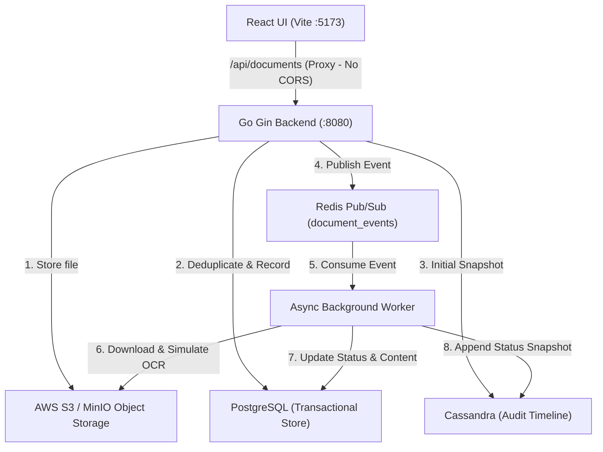

# DocManager - Document Ingestion & Cassandra Event Audit Service

A full-stack document ingestion platform with automated OCR simulation, content deduplication, asynchronous job processing, and an immutable Cassandra audit timeline.

---

## Architecture Overview



- **Frontend**: React 19, TypeScript, Vite, custom dark-mode glassmorphic styling, Lucide icons.
- **Backend**: Go 1.26 (Gin, pgx/v5, gocql, go-redis, AWS SDK v2, Swaggo).
- **PostgreSQL**: Stores canonical document records, content SHA-256 hashes, status, and OCR extracted content.
- **Apache Cassandra**: Stores immutable, append-only event snapshots (`document_snapshots` table) tracking every state transition.
- **Redis**: Coordinates async processing via Pub/Sub messaging.
- **AWS S3**: Durable file object storage.
- **Task**: Unified task runner orchestrating services and development environments.

---

## Prerequisites

Ensure the following tools are installed on your machine:

1. **Go**: Version 1.22 or higher (`go version`)
2. **Node.js**: Version 18+ and npm (`node -v`, `npm -v`)
3. **Docker & Docker Compose**: For running Cassandra (`docker compose version`)
4. **Task (go-task)**: Task runner tool:
   ```bash
   # On macOS via Homebrew:
   brew install go-task

   # Or via Go:
   go install github.com/go-task/task/v3/cmd/task@latest
   ```

---

## Configuration Guide: `secrets.json`

The backend reads configuration directly from `backend/resources/secrets.json`. A clean template is provided at `backend/resources/secrets.json.example`.

### File Location
```
backend/resources/secrets.json
```

### Configuration Sections

```json
{
  "postgres": {
    "user": "postgres",
    "password": "your_postgres_password",
    "host": "localhost",
    "port": "5432",
    "database_name": "doc_manager",
    "sslmode": "disable",
    "max_conns": 10,
    "min_conns": 2,
    "auto_migrate": true,
    "seed": false,
    "migrations_path": "migrations/postgres"
  },
  "redis": {
    "addr": "localhost:6379",
    "host": "localhost",
    "port": "6379",
    "password": "",
    "db": 0
  },
  "cassandra": {
    "hosts": [
      "127.0.0.1"
    ],
    "port": 9042,
    "keyspace": "doc_manager",
    "username": "",
    "password": "",
    "consistency": "LOCAL_QUORUM"
  },
  "s3": {
    "bucket": "doc-manager-bucket",
    "region": "us-east-1",
    "endpoint": "",
    "access_key": "mock_access_key",
    "secret_key": "mock_secret_key",
    "use_path_style": true
  }
}
```

### Field-by-Field Breakdown

| Section | Parameter | Description |
| :--- | :--- | :--- |
| **`postgres`** | `user` / `password` | PostgreSQL database user credentials |
| | `host` / `port` | Database host (e.g. `localhost` or Docker IP) and port (`5432`) |
| | `database_name` | Name of the database (`doc_manager`) |
| | `sslmode` | `disable` for local development, `require` for TLS |
| | `max_conns` / `min_conns` | Connection pool thresholds (recommended: 10 / 2) |
| | `auto_migrate` | `true` to automatically run SQL migrations on backend startup |
| | `migrations_path` | Relative path to SQL migrations (`migrations/postgres`) |
| **`redis`** | `addr` / `host` / `port` | Redis server address (default: `localhost:6379`) |
| | `password` | Redis auth password (leave `""` if unauthenticated) |
| | `db` | Redis logical database index (`0`) |
| **`cassandra`** | `hosts` | List of Cassandra seed nodes (e.g. `["127.0.0.1"]`) |
| | `port` | Native transport port (`9042`) |
| | `keyspace` | Cassandra keyspace (`doc_manager`, created automatically) |
| | `consistency` | Query consistency: `LOCAL_QUORUM`, `ONE`, or `QUORUM` |
| **`s3`** | `bucket` | Target S3 bucket name (`doc-manager-bucket`) |
| | `region` | AWS region (e.g. `us-east-1`) |
| | `endpoint` | Custom endpoint for LocalStack/MinIO (e.g. `http://localhost:4566`); leave empty `""` for AWS |
| | `access_key` / `secret_key` | AWS IAM credentials or mock credentials for local dev |
| | `use_path_style` | `true` for MinIO/LocalStack or path-style addressing |

---

## Quickstart Guide

### 1. Start Infrastructure (Cassandra)
Start the Cassandra container via Docker Compose:
```bash
task docker:up
```
*(Ensure PostgreSQL and Redis are also running locally or in your Docker environment).*

### 2. Prepare Secrets
Copy the example template and adjust values if needed:
```bash
cp backend/resources/secrets.json.example backend/resources/secrets.json
```

### 3. Install Dependencies
Install frontend npm packages and backend Go modules in one command:
```bash
task install
```

### 4. Start Both Servers Concurrently
Start both backend (:8080) and frontend (:5173) together:
```bash
task dev
```

- **React Web UI**: `http://localhost:5173`
- **Go API Server**: `http://localhost:8080`
- **Swagger Documentation**: `http://localhost:5173/swagger/index.html` or `http://localhost:8080/swagger/index.html`

---

## How CORS is Avoided

Cross-Origin Resource Sharing (CORS) issues are handled through two layers:

1. **Vite Development Proxy (Primary)**:
   The frontend dev server in `frontend/vite.config.ts` proxies all `/api/*` and `/swagger/*` requests directly to `http://localhost:8080`. The browser communicates with `http://localhost:5173` exclusively, eliminating cross-origin preflights and restrictions.
2. **Gin CORS Middleware (Fallback)**:
   `backend/routers/routes.go` includes standard CORS middleware allowing `GET, POST, PUT, DELETE, OPTIONS` and responding to `OPTIONS` preflight requests with `204 No Content`.

---

## Task Command Reference

All project actions can be invoked using `task <command>`:

| Command | Description |
| :--- | :--- |
| `task dev` | Starts both backend and frontend concurrently |
| `task backend` | Starts the Go backend server (`go run main.go`) |
| `task frontend` | Starts the Vite React frontend dev server (`npm run dev`) |
| `task install` | Downloads Go modules and installs frontend npm packages |
| `task test` | Runs the Go test suite and validates frontend build |
| `task test:backend` | Runs `go test -v ./...` in the backend |
| `task docker:up` | Starts Cassandra in detached mode |
| `task docker:down` | Stops Cassandra container |
| `task swagger` | Re-generates Swagger API documentation with `swag init` |
| `task --list` | Displays all available tasks |

*(Alternatively, you can run `npm run dev` or `npm run test` from the root directory).*

---

## API & Swagger Documentation

Interactive Swagger documentation is available at:
`http://localhost:8080/swagger/index.html` (or via Vite proxy at `http://localhost:5173/swagger/index.html`).

### Endpoints

#### 1. Upload Document
- **Endpoint**: `POST /api/documents`
- **Content-Type**: `multipart/form-data`
- **Form Fields**:
  - `file` *(required)*: The document file (PDF, CSV, image, text, etc.)
  - `typeOfFile` *(optional)*: MIME type (e.g. `application/pdf`, `text/csv`)
  - `optionalMeta` *(optional)*: Custom metadata string or JSON
- **Responses**:
  - `200 OK`: Returns the created document object.
  - `409 Conflict`: Returned if an identical document (`content_hash` and `name`) already exists in the database.
  - `400 Bad Request`: Missing file or invalid payload.

#### 2. Get Document Event History
- **Endpoint**: `GET /api/documents/:id/events`
- **URL Parameter**: `id` *(UUID string)*
- **Responses**:
  - `200 OK`: Array of historical `DocumentSnapshot` records stored in Cassandra, ordered chronologically.
  - `400 Bad Request`: Invalid UUID format.
